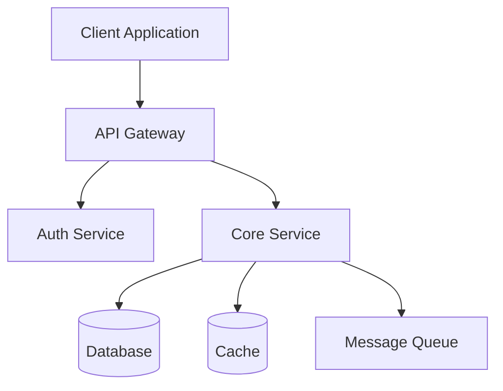
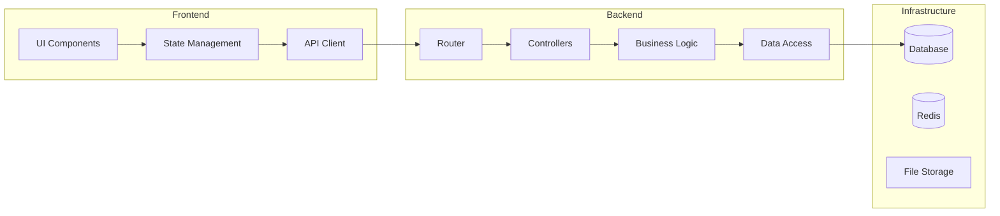
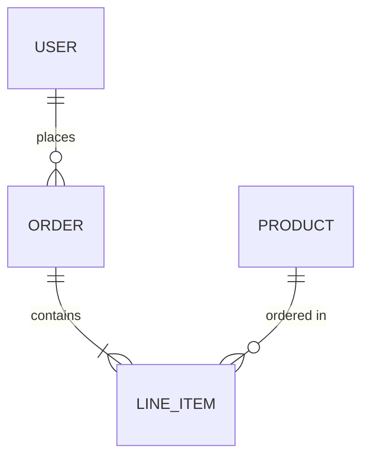

# Architecture Design Document

## Feature: {{FEATURE_NAME}}
**Date:** {{DATE}}
**Author:** System Architect Agent
**Status:** Draft

---

## 1. Overview

### 1.1 Purpose
{{PURPOSE}}

### 1.2 Scope
{{SCOPE}}

### 1.3 Design Goals
- Maintainability
- Scalability
- Testability
- Security
- Performance

## 2. System Architecture

### 2.1 High-Level Architecture



### 2.2 Component Diagram



## 3. Component Design

### 3.1 {{COMPONENT_1}}
**Responsibility:** {{RESPONSIBILITY}}
**Interface:**
```typescript
interface {{INTERFACE_NAME}} {
  // Methods
}
```

### 3.2 {{COMPONENT_2}}
**Responsibility:** {{RESPONSIBILITY}}

## 4. Data Model

### 4.1 Entity Relationship



### 4.2 Schema Definitions
```typescript
interface {{ENTITY}} {
  id: string;
  createdAt: Date;
  updatedAt: Date;
  // Fields
}
```

## 5. API Design

### 5.1 Endpoints
| Method | Path | Description | Auth |
|--------|------|-------------|------|
| GET | /api/v1/{{resource}} | List resources | Yes |
| POST | /api/v1/{{resource}} | Create resource | Yes |
| GET | /api/v1/{{resource}}/:id | Get resource | Yes |
| PUT | /api/v1/{{resource}}/:id | Update resource | Yes |
| DELETE | /api/v1/{{resource}}/:id | Delete resource | Yes |

### 5.2 Request/Response Schemas
```json
{
  "data": {},
  "meta": {
    "page": 1,
    "total": 100
  }
}
```

## 6. Security Architecture
- Authentication: JWT with refresh tokens
- Authorization: RBAC with resource-level permissions
- Input validation on all endpoints
- Rate limiting: 100 req/min per user
- CORS: Whitelist specific origins

## 7. Error Handling Strategy
- Structured error responses with error codes
- Retry with exponential backoff for transient failures
- Circuit breaker for external service calls
- Graceful degradation when dependencies are unavailable

## 8. Performance Considerations
- Database indexing strategy
- Query optimization and N+1 prevention
- Caching strategy (TTL, invalidation)
- Connection pooling
- Lazy loading for large datasets

## 9. Technical Decisions

| Decision | Choice | Alternatives Considered | Rationale |
|----------|--------|------------------------|-----------|
| {{DECISION}} | {{CHOICE}} | {{ALTERNATIVES}} | {{RATIONALE}} |

## 10. Risks and Mitigations

| Risk | Impact | Mitigation |
|------|--------|------------|
| {{RISK}} | {{IMPACT}} | {{MITIGATION}} |
